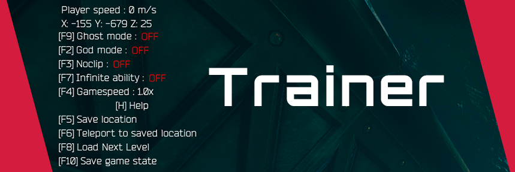
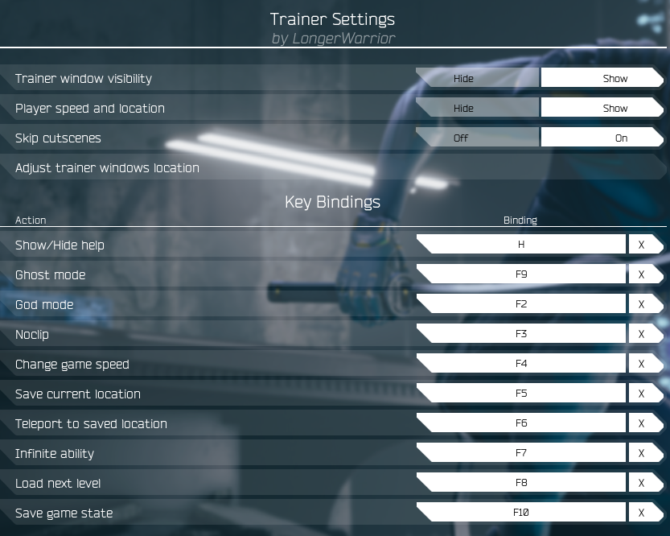

# Trainer

**Description:** Allows the player to fly, become immortal, teleport and much more!

### Features:
- **Skips Cutscenes** - Skips the majority of unskippable cutscenes.
- Ghost Mode - Player becomes invisible to enemies.
- God Mode - Player becomes immortal.
- Noclip - Fly around the level with no collision.
- Infinite Ability - No cooldown for Abilities.
- Game speed - Set game speed multiplier.
- Save/Teleport - Save player position and teleport back to it at any time.
- Load Next Level - Loads the next level in queue.
- Save game state - Creates a custom checkpoint at player location.
- Displays player speed and location.
- Default keybindings and layout location can be changed via Mod Settings.

**Controls:**

Trainer Settings are located in Settings->Gameplay->Mod Settings

- H: Show/Hide help
- F2: God mode
- F3: Noclip
- F4: Change game speed
- F5: Save current location
- F6: Teleport to saved location
- F7: Infinite ability
- F8: Load next level
- F9: Ghost mode
- F10: Save game state
  
All keybinding can be changed via Mod Settings.

**Author:** [LongerWarrior](https://github.com/LongerWarrior/)

**Download:** [Trainer.pak](https://github.com/Dmgvol/Ghostrunner-Mods/raw/main/LogicMods/Trainer/Trainer.pak)

## In-Game Screenshots
Gameplay

Settings
