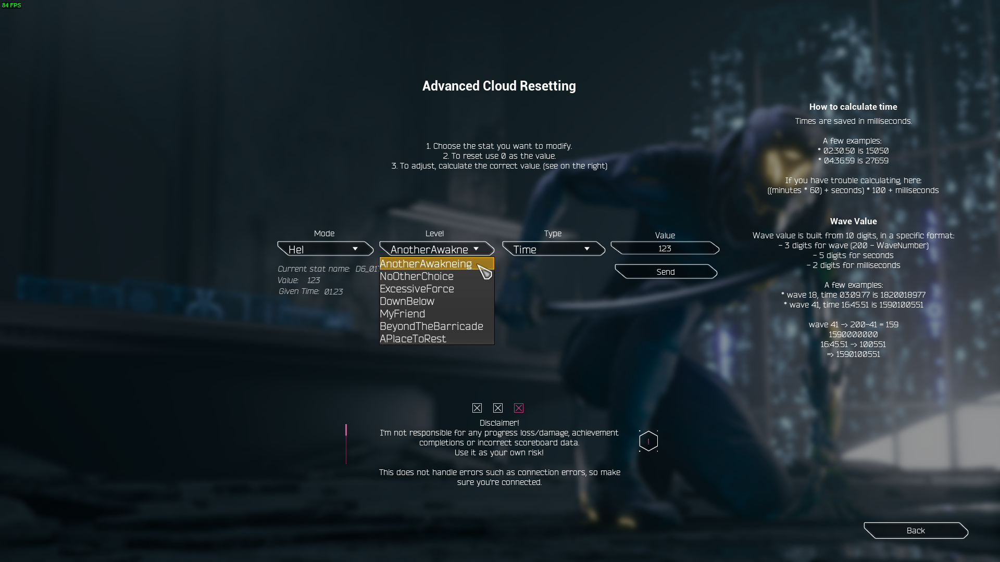

# GRUnlocker

Supports WaveMode branch (game versions 40019.x and higher)
 
Running Killrun or older versions? use the older [GRUnlocker v1](https://github.com/Dmgvol/GRUnlocker/)

**Description:** Unlocks levels, collectibles, 100% and more!

### Features:
- Unlock/Reset Levels (Classic, Hardcore, KillRun).
- Unlock/Reset Swords, Gloves, Audio files, Story Items, Upgrades.
- Unlock up to a specific level with corresponding upgrades.
- Unlocks 100% save (All levels, upgrades and collectibles).
- Unlock the hidden double-jump.
- Backup/Load loaded save.
- Reset cloud data for KR and Wave.
- Advanced Cloud Resetting: 
   - Reset/modify any cloud data - deaths/times/WaveData.
   - Supports all individual levels, all difficulties and all game modes.

**Controls:**

Unlocker is accessible through `Settings->Gameplay->Mod Settings->Open Unlocker Panel` 

**Author:** [DmgVol](https://github.com/Dmgvol/)

**Download:** [Unlocker.pak](https://github.com/Dmgvol/Ghostrunner-Mods/raw/main/LogicMods/Unlocker/Unlocker.pak)

**How to install:** [Mod FAQ](https://github.com/Dmgvol/Ghostrunner-Mods/blob/main/modding-faq.md#first-time-usingdownloading-a-logicmod-follow-these-steps)

### Disclaimer
Make sure you backup your `.save` file before you run the mod! (just in case).
I'm not responsible for any progress loss or/and achievements completions, so keep a backup prior to using it.

## In-Game Screenshots
  
