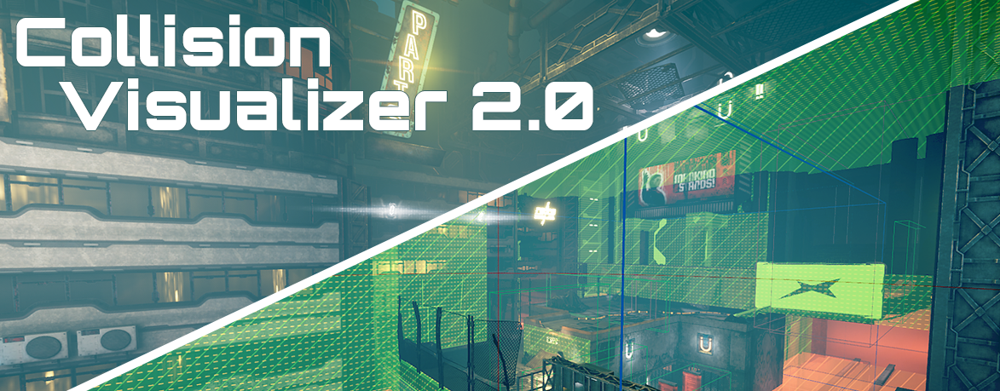

# The Visualizer 2.0

 
**Description:** The true form of the visualizer: invisible walls, kill volumes, checkpoints, triggers/events, enemies, navigation boundaries, hitboxes, LODs, and much more!
 
**Controls:** 
- It visualizes on level load, in case you want to manually force it: 
- - open ModMenu (F1), Visualizer contains one button: Force-Visualizer.

_Note: Support Hel Update_

**Author:** [DmgVol](https://github.com/Dmgvol/)
 
**Download:** [VisualizerMod.pak](https://github.com/Dmgvol/Ghostrunner-Mods/raw/main/LogicMods/VisualizerMod/VisualizerMod.pak)

## In-Game Screenshots

