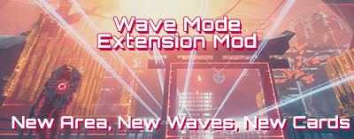

# Wave Mode - Extension Mod
 
20 waves was not enough for us so we doubled it.

- 15 New Waves (35 total waves + 1 secret wave)
- Double the map area, new obstacles!
- 3 New Upgrade Cards.
- Can equip up to 35 upgrades.

**Author:** [DmgVol](https://github.com/Dmgvol/) & [LongerWarrior](https://github.com/LongerWarrior/)

**Download:** [WaveMod.pak](https://github.com/Dmgvol/Ghostrunner-Mods/raw/main/LogicMods/WaveMod/WaveMod.pak)

**How to install:** [Mod FAQ](https://github.com/Dmgvol/Ghostrunner-Mods/blob/main/modding-faq.md#first-time-usingdownloading-a-logicmod-follow-these-steps)

**Disclaimer:**  
This will affect your final online leaderboard score, setting your wave count higher than max default.
(if you care about your online leaderboard stats for WaveMode - avoid using this mod)

## Screenshots

