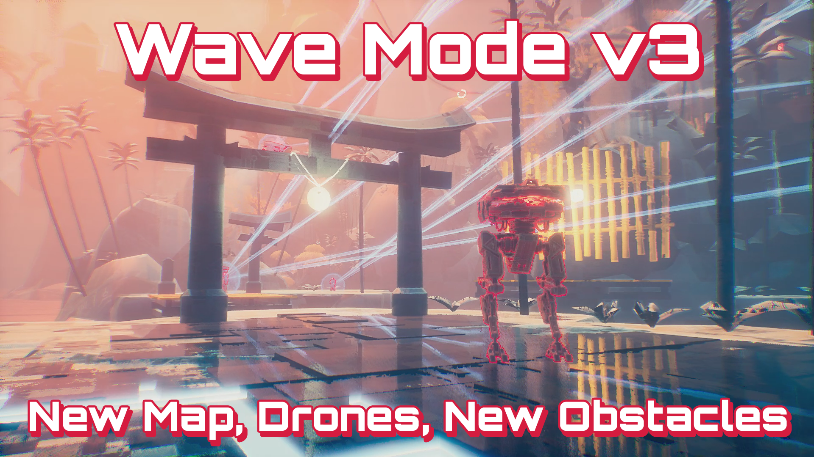
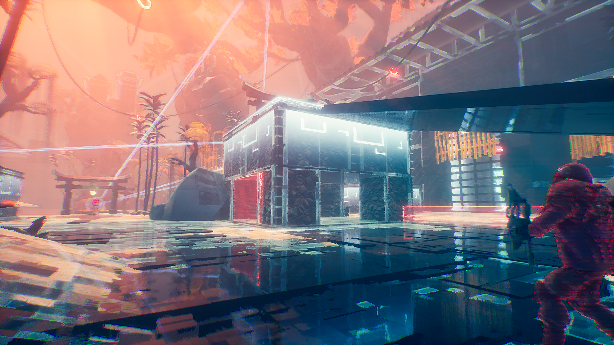
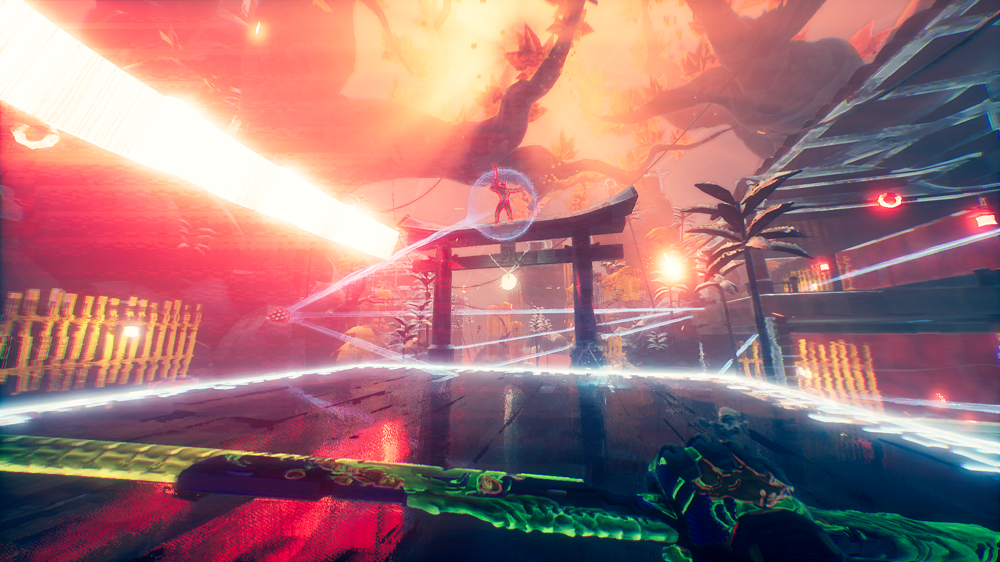
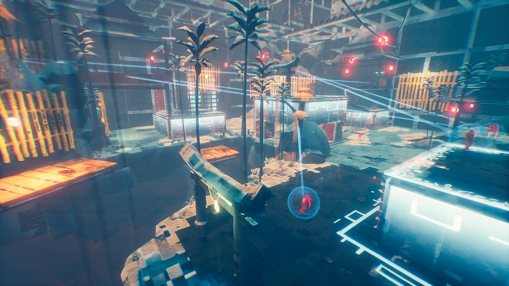

# Wave Mode - Version 3
 
Brand new map, bigger with even more obstacles and challenges. 
Comes with additional difficulty levels such limited lives and upgrades. 
Drones join the party along with crazy enemy buffs on advanced waves.

Reveal Trailer: [Wave Mode v3 Trailer](https://www.youtube.com/watch?v=9aRWuitL9Ys)

- Brand new map.
- Local leaderboards for each of the difficulties and maps.
- Ability to skip to wave 20. 
- Additional Difficulty levels: limited time/deaths/upgrades and more.
- Drones.
- New obstacles: Laser walls and moving lasers.
- Up to 35 waves in total.
- Enemies buffed after wave 29.
- New Cards.
- A whole new experience for Wave Mode you have never seen before.

**Requirments:** Hel Update and higher, game version 0.42441.48+ (UE4.26)

**Author:** [DmgVol](https://github.com/Dmgvol/) & [LongerWarrior](https://github.com/LongerWarrior/)

**Download:** [WaveMod.pak](https://github.com/Dmgvol/Ghostrunner-Mods/raw/main/LogicMods/WaveModV3/WaveMod.pak)

**How to install:** [Mod FAQ](https://github.com/Dmgvol/Ghostrunner-Mods/blob/main/modding-faq.md#first-time-usingdownloading-a-logicmod-follow-these-steps) 
**Quick installation video:** [How to install WaveMode - Version 3](https://youtu.be/HgXQiQB5faw)

**Note:** Make sure you use the latest Modloader and update the matching `.sig` file.

**Disclaimer:**  
This will affect your final online leaderboard score, setting your wave count higher than max default.
(if you care about your online leaderboard stats for WaveMode - avoid using this mod) 
You can reset/edit your cloud data for wave mode using the [Unlocker](/LogicMods/Unlocker/unlocker.md).

## Screenshots

