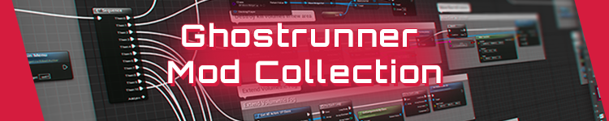

   

# Ghostrunner-Mods

Collection of mods for Ghostrunner ranging from basic to professional mods, including tips and tricks on how to mod Ghostrunner.

---

### Logic Mods
- [Example - description](./LogicMods/ModExample/modexample.md)

### Regular Mods
- Coming Soon

### Community Mods
- Coming Soon

 

---

## Useful Links
- [Ghostrunner Modding Guides](https://github.com/Dmgvol/GR_Guides) - from basic to advanced.
- [UnrealModLoader](https://github.com/RussellJerome/UnrealModLoader) - **Required for all LogicMods.**
- [Ghostrunner FAQ](https://github.com/Kellegram/Ghostrunner_faq)

## Discords
- [Official GR - Discord](discord.gg/Ghostrunner).
- [GR Speedrunning/Modding - GRSR Discord](discord.gg/gYGgtzC5s2).

# Credits
- [DmgVol](https://github.com/Dmgvol/) and [LongerWarrior](https://github.com/longerwarrior/) for creating awesome mods non-stop.
- [RussellJerome]() for creating the [UnrealModLoader](https://github.com/RussellJerome/UnrealModLoader).
- The whole GR community for supporting our work.
- [One More Level](https://www.omlgames.com/en/home/) and [Slipgate Ironworks](http://slipgate-ironworks.com/)for developing the game.
